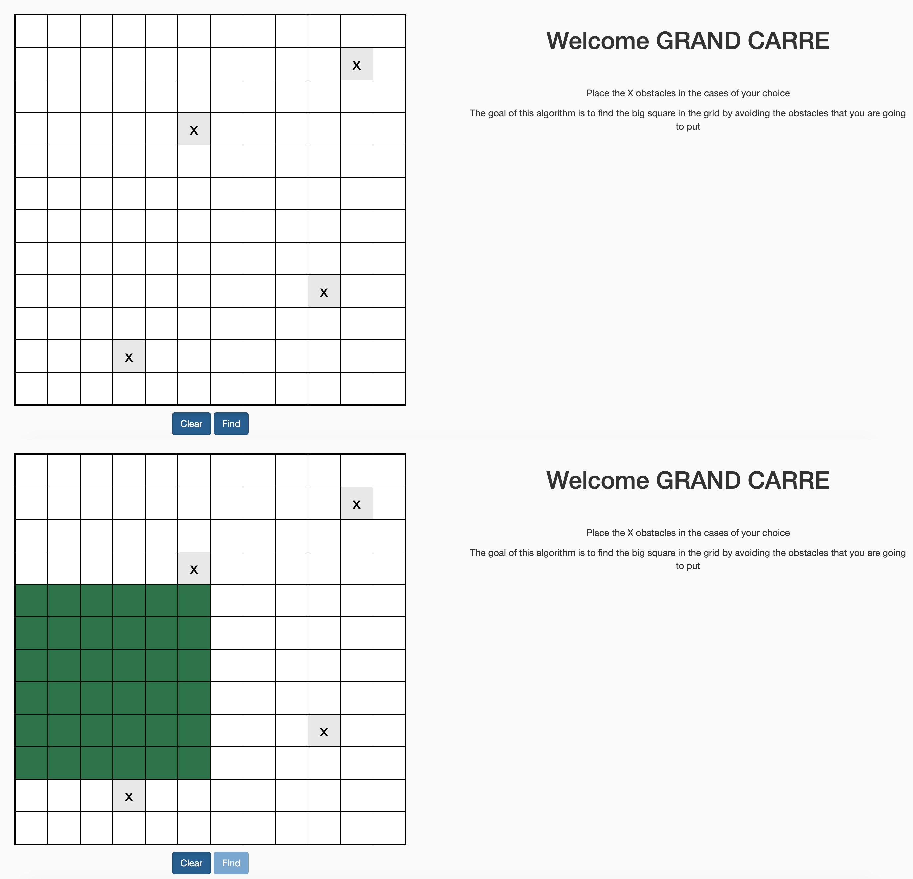

# Le grand carré (The big square)

This program help you to find the bigest "le grand carré" in a Matrix.




# Install the dependencies

`pip3 install -r requirements.txt`

# Lunch the program

## With docker

`python3 run.py`
### Build the image`

`docker build -t square .`

### Lunch the docker

`docker run -d -p 5000:5000 square`

## With local programming environment

Create an env directory :

```
mkdir env
cd env
```

Create the env :

```
python3 -m venv env
```

Activate the env : 

```
source my_env/bin/activate 
```

# Algorithme

To find the big square in the matrix, we apply the folow algo :

1. For each case/point find the big square 
2. Return the bigest square of all the case/point

## The square of point 

```python

def get_square_by_point(self, i, j):
        """
        Return a square by point(i, j)
        """
        test_number = 0
        
        while test_number < min((len(self.matrix) - i), (len(self.matrix[0]) - j)):
            for line in range(i, i + test_number) :
                for column in range(j, j + test_number) :
                    if self.obstacle_caractere == self.matrix[line][column] :
                        return (i, j, test_number-1)
            test_number += 1

        return (i, j, test_number)

```

### Get the bigest square 

Return the bigest dimension in the list of all tuple(row, column, dimension) solution.

```python

def get_big_square(self, matrix_solution):
        #get the biggest value
        bigest_carre = (0,0,0)

        for solution in matrix_solution:
            if solution is not None :
                if solution[2] == bigest_carre[2] :
                    if solution[0] < bigest_carre[0]:
                        bigest_carre = solution
                    elif solution[1] < bigest_carre[1]:
                        bigest_carre = solution
                elif solution[2] > bigest_carre[2] :
                    bigest_carre = solution

        return bigest_carre

```

## Testing : 

```
make test
```